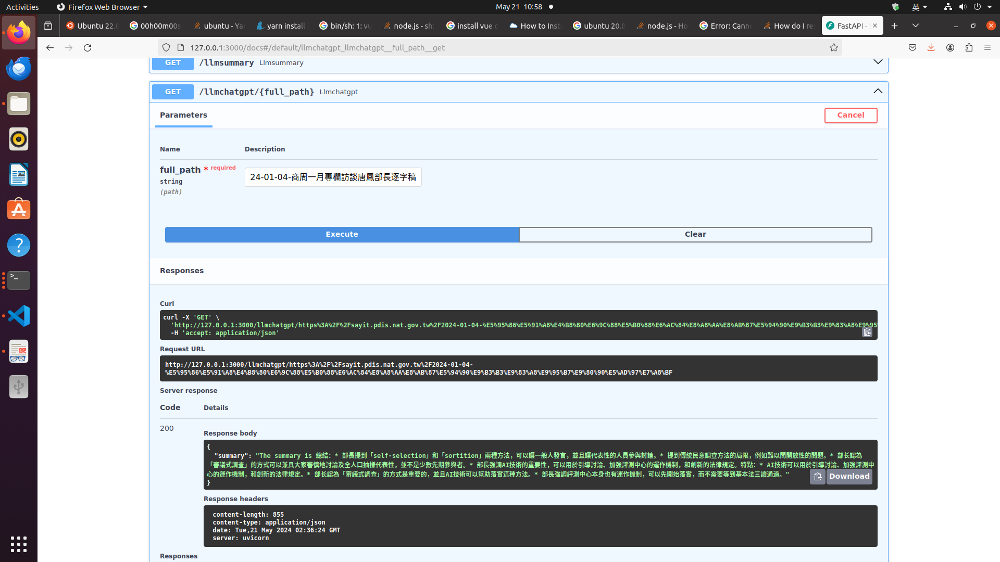
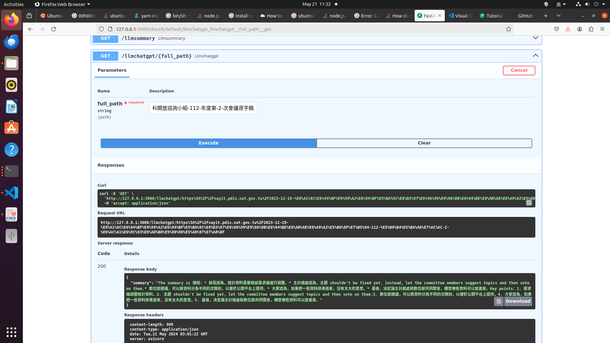
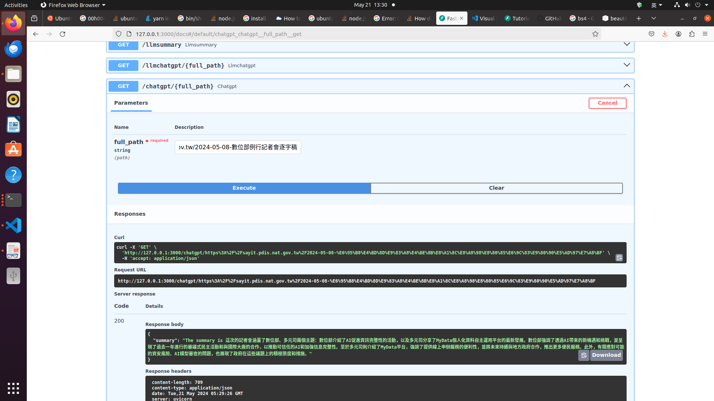

# Why you implement like this and technical design?
Explain use following LLM model to execute summary work: Chatgpt 3.5.turbo
For popularity and response quickly of LLM, I select Chatgpt 3.5.turbo to execute summary work. 

Simple is beauty. I like to implement step by step to reach the final goal as the following steps:
Step1. Get webpage content from the given URL and show the result of original webpage contents, eg. getweb3.py
Step2. Get webpage and show the parsing result from original webpage contents. Obtain the useful information for initial query strings, eg. getweb3.py
Step3. Using OpenAI API to find query result, eg. keithchtgpt.py
Step4. Apply into LLM with the initial query strings. Finially, obtain the reply information from LLM, eg. keithwebchatgpt.py 
Step5. Modify the given URL with dynamic input method, eg. ../keithllmfastapi/main.py
Step6. Change LLM from OpenAI into ollama, eg. ../keithllmfastapi/main.py
Step7. Implement vue3 frontend to apply LLM, eg. ../keithchatgpt

Technical design: 
1. using [BeautifulSoup] (https://pypi.org/project/beautifulsoup4/) to parsing webpage.
2. Introduce [OpenAI] 3.5.turbo (https://platform.openai.com/docs/models/gpt-3-5-turbo) for the time saving during development status.
3. using [FastAPI] (https://fastapi.tiangolo.com/) to provide API with test GUI automatically. We can input any url for each test.

# Output evalution
You need to evalute your output results with
1.List the input test case (transcription) that you tried
input transcription_target_url
output json result format {"summary": "The summary is xxx."}

Self-evalution Final Test on Ubuntu 20.04 on 20240521
1-1. Check Environment
Environment Ubuntu 20.04
keithkslee@keithkslee-s101A:~/keithllmsrc/keithllmfastapi$ uname -a
Linux keithkslee-s101A 5.15.0-107-generic #117~20.04.1-Ubuntu SMP Tue Apr 30 10:35:57 UTC 2024 x86_64 x86_64 x86_64 GNU/Linux
keithkslee@keithkslee-s101A:~/keithllmsrc/keithllmfastapi$

Language python3.9+
keithkslee@keithkslee-s101A:~/keithllmsrc/keithllmfastapi$ python3 --version
Python 3.9.19
keithkslee@keithkslee-s101A:~/keithllmsrc/keithllmfastapi$

Any python-based projects : fastapi framework
keithkslee@keithkslee-s101A:~/keithllmsrc/keithllmfastapi$ ls
 main.py       REPORT.md
 __pycache__  'Screenshot from 2024-05-18 18-49-10.png'
 queryllm.sh  'Screenshot from 2024-05-20 10-36-39.png'
 README.md
keithkslee@keithkslee-s101A:~/keithllmsrc/keithllmfastapi$

1-2. Meet Goal
Goal: Input URL string name transcription_target_url and 
Output summary json format {"summary":"This summary is xxxxx"}

Terminal1: Run local llm ollama
keithkslee@keithkslee-s101A:~$ ollama run llama3
>>> Send a message (/? for help)

Terminal2: Run fastapi
keithkslee@keithkslee-s101A:~/keithllmsrc/keithllmfastapi$ uvicorn main:app --port 3000
INFO:     Started server process [98384]
INFO:     Waiting for application startup.
INFO:     Application startup complete.
INFO:     Uvicorn running on http://127.0.0.1:3000 (Press CTRL+C to quit)
INFO:     127.0.0.1:59406 - "GET /docs HTTP/1.1" 200 OK
INFO:     127.0.0.1:59406 - "GET /openapi.json HTTP/1.1" 200 OK

Open Browser
http://127.0.0.1:3000/docs

Test1 
click GET /llmchatgpt/{full_path}
click Try it out
provide https://sayit.pdis.nat.gov.tw/2024-01-04-商周一月專欄訪談唐鳳部長逐字稿
click execute
Running http://127.0.0.1:3000/docs#/default/llmchatgpt_llmchatgpt__full_path__get
Return json result as follows:
{
  "summary": "The summary is 總結：* 部長提到「self-selection」和「sortition」兩種方法，可以讓一般人發言，並且讓代表性的人員參與討論。* 提到傳統民意調查方法的局限，例如難以問開放性的問題。* 部长認為「審議式調查」的方式可以兼具大家審慎地討論及全人口抽樣代表性，並不是少數先期參與者。* 部長強調AI技術的重要性，可以用於引導討論、加強評測中心的運作機制，和創新的法律規定。特點：* AI技術可以用於引導討論、加強評測中心的運作機制，和創新的法律規定。* 部长認為「審議式調查」的方式是重要的，並且AI技術可以幫助落實這種方法。* 部長強調評測中心本身也有運作機制，可以先開始落實，而不需要等到基本法三讀通過。"
}

Test2 
click GET /llmchatgpt/{full_path}
click Try it out
Using different transcription_target_url
https://sayit.pdis.nat.gov.tw/2023-12-19-行政院政府資料開放諮詢小組-112-年度第-2-次會議逐字稿
Return json result as follows:
{
  "summary": "The summary is 總結：* 部長認為，統計資料需要根據需求端進行調整。* 主計總處認為，主題 shouldn't be fixed yet, instead, let the committee members suggest topics and then vote on them.* 數位部建議，可以將資料分為不同的次類別，以便於公開平台上提供。* 大家認為，如果把一些資料拼湊過來，沒有太大的意思。* 最後，決定讓主計總處和數位部共同開會，構思哪些資料可以放進來。Key points：1. 需求端調整統計資料。2. 主題 shouldn't be fixed yet, let the committee members suggest topics and then vote on them.3. 數位部建議，可以將資料分為不同的次類別，以便於公開平台上提供。4. 大家認為，如果把一些資料拼湊過來，沒有太大的意思。5. 最後，決定讓主計總處和數位部共同開會，構思哪些資料可以放進來。"
}

Test3 (Extra Test)
click GET /chatgpt/{full_path}
click Try it out
https://sayit.pdis.nat.gov.tw/2023-12-19-行政院政府資料開放諮詢小組-112-年度第-2-次會議逐字稿
OpenAI have length limit:
raise self._make_status_error_from_response(err.response) from None
openai.BadRequestError: Error code: 400 - {'error': {'message': "This model's maximum context length is 16385 tokens. However, your messages resulted in 25631 tokens. Please reduce the length of the messages.", 'type': 'invalid_request_error', 'param': 'messages', 'code': 'context_length_exceeded'}}

Test4 (Extra Test) 
click GET /chatgpt/{full_path}
https://sayit.pdis.nat.gov.tw/2024-05-08-數位部例行記者會逐字稿
Return json result as follows:
{
  "summary": "The summary is 這次的記者會涵蓋了數位部、多元司兩個主題：數位部介紹了AI促進資訊完整性的活動，以及多元司分享了MyData個人化資料自主運用平台的最新發展。數位部強調了透過AI帶來的新機遇和挑戰，並呈現了過去一年進行的審議式民主活動和與國際大廠的合作，以推動可信任的AI和加強信息完整性。至於多元司則介紹了MyData平台，強調了提供線上申辦服務的便利性，並將未來持續與地方政府合作，推出更多便民服務。此外，有關應對可能的資安風險、AI模型審查的問題，也展現了政府在這些議題上的積極態度和措施。"
}

2.Explaination of what, how and why
The OpenAPI LLM API is provided by OpenAI for quick verifing implementation concepts.
The ollama LLM Server is running under Ubuntu20.04 with python3.9.1 as user requirement.
OpenAI reponse time is less than ollama, because of model size different.
OpenAI have 16385 tokens limit. However ollama pass the same url test for cost saving.

3.Describe challenge, difficulty and insight
Inference runtime for ollama llama3 are more than chatgpt 3.5.turbo to verify execution result under each develop steps. That why I select chatgpt 3.5.turbo for develop purpose to saving develop time.

If website change, we need to chage different parsing methods. We can design different parsing methods using external configure files to solve different website content.  

Fix bonus work cross sites problem. (https://stackoverflow.com/questions/65635346/how-can-i-enable-cors-in-fastapi)

# Contributer
The main contributer is Keith K.S. Lee keith.kslee@gmail.com

